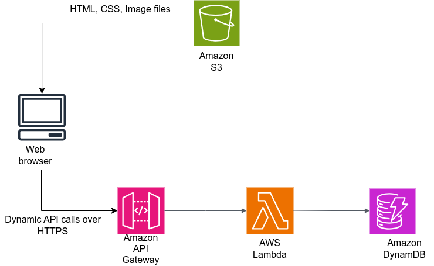

# Build and deploy a Serverless Resume Website

Deployement of high-performance, serverless application on AWS, resulting in a dynamic HTML resume website with real-time visitor tracking. The webpage displays a dynamic visitor counter, using a REST API and a Lambda function communicating with a DynamoDB database. The S3 bucket endpoint, and REST API endpoint are served using Amazon CloudFront.

## AWS Services and Architecture used

- Amazon S3: For hosting the static content of the application (HTML, CSS, and image files).
- AWS Identity and Access Management (IAM): For AWS resource identity and access management.
- DynamoDB: A NoSQL database that provides a persistent layer where the dynamic page visitor counts are stored.
- AWS Lambda: Runs Python code that retrieves and updates visitor counts in the DynamoDB table.
- AWS API Gateway: Used to create a Lambda proxy integrated REST API endpoint that uses the GET method to fetch data from the DynamoDB table.
- AWS Route53: For DNS routing
- AWS Serverless Application Model (SAM): An open-source infrastructure-as-code platform used to build, test, and deploy API Gateway and Lambda Function resources.

## Some usefull links

- [Getting started with Cloudfront](https://docs.aws.amazon.com/Route53/latest/DeveloperGuide/getting-started-cloudfront-overview.html#getting-started-cloudfront-request-certificate)

- [API Gateway tutorial](https://docs.aws.amazon.com/lambda/latest/dg/services-apigateway-tutorial.html#services-apigateway-tutorial-role)

- [Lambda best practices](https://docs.aws.amazon.com/lambda/latest/dg/best-practices.html)

